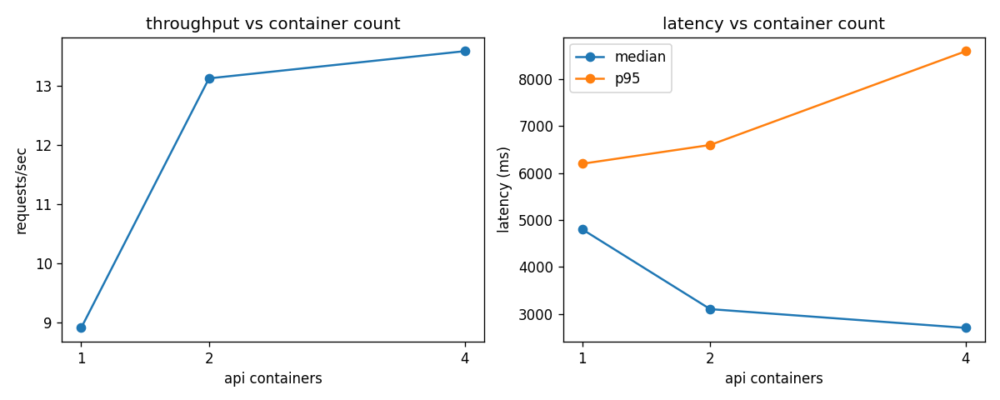

# Flood test results

Ran with `locust -f locust/locustfile.py --host http://localhost:8000 --headless -u 50 -r 10 -t 2m`
against nginx in front of the api service, scaled to 1/2/4 containers via
`docker compose up -d --scale api=N`. Each run hits `/predict` with real images sampled from
`data/test`.

One thing worth calling out before the numbers: this ran on a single laptop, so all the
containers (and Docker Desktop's own VM) are sharing the same CPU cores. This isn't a cluster
test, it's a "how much does horizontal scaling help when it's still bottlenecked on one
machine's CPU" test - which is honestly a more realistic scenario for this project's Render
deployment (single small instance) than an infinite-hardware benchmark would be.

### Results

| API containers | RPS | Median latency (ms) | p95 latency (ms) | Failures |
|---|---|---|---|---|
| 1 | 8.91 | 4800 | 6200 | 3 / 1042 (0.29%) |
| 2 | 13.13 | 3100 | 6600 | 0 / 1578 |
| 4 | 13.59 | 2700 | 8600 | 0 / 1629 |

### What this actually shows

Going from 1 to 2 containers is the clear win - throughput jumps ~47% and median latency
drops by over a third, and the handful of failures at 1 container (which were simple request
timeouts under queueing, not crashes) disappear entirely. That matches the theory: with only
one worker process handling every request serially, the queue backs up under 50 concurrent
users and something eventually times out.

Going from 2 to 4 containers barely moves RPS (13.13 to 13.59) and median latency keeps
improving a bit (3100 to 2700ms), but p95 actually gets worse (6600 to 8600ms). That's the
CPU-sharing problem mentioned above - 4 TensorFlow processes doing inference at once on a
laptop's CPU cores are now fighting each other for compute, so the extra replicas add queueing
capacity (helps the median/typical case) but also add contention (hurts the tail). On real
separate hardware (or a machine with more cores than I have here) I'd expect 4 containers to
scale closer to linearly, similar to the 1-to-2 jump.

The practical takeaway for this project: 2 containers is roughly where the useful scaling
happens on this deployment target's resources, and pushing higher without more CPU just
trades tail latency for a small median improvement.
